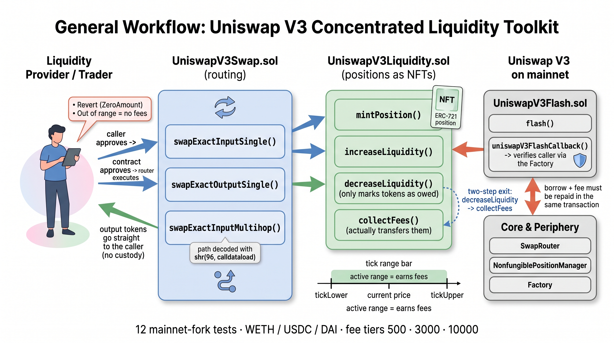

<div align="center">
  <h1>💧 Concentrated Liquidity — Uniswap V3 Toolkit</h1>
  <p><b>A Foundry toolkit for Uniswap V3 concentrated liquidity: swaps, NFT position management and flash loans, verified against a mainnet fork</b></p>
</div>

## 📖 About the Project

**Concentrated Liquidity** is a production-ready Web3 Smart Contract project built with **Solidity** `0.8.26` and thoroughly tested using the **Foundry** framework. It wraps the Uniswap V3 core and periphery protocols into three focused contracts: one for swaps (`exactInputSingle`, `exactOutputSingle` and multi-hop routing), one for concentrated liquidity positions managed as ERC-721 NFTs, and one for flash loans with a hardened callback.

The project is built for engineers who need to understand and integrate V3 rather than reimplement it. Every flow is exercised against the **real mainnet deployment** — the canonical SwapRouter, NonfungiblePositionManager and Factory, with real WETH/USDC/DAI pools — so the repository doubles as executable documentation of how the protocol behaves with production liquidity, ticks and fee tiers.

**Key Technical Highlights:**
* **Solidity `0.8.26`:** Custom errors on every guard, immutables for the router, factory and position manager, and no proxy or upgradeability surface.
* **Uniswap V3 integration:** `v3-core` v1.0.0 and `v3-periphery` v1.3.0 wired as git submodules, with a local copy of the `INonfungiblePositionManager` interface.
* **Foundry fork testing:** A 12-case suite that forks Ethereum mainnet and executes real swaps, mints real positions and runs real flash loans against live pools.
* **Concentrated liquidity mechanics:** Tick math, tick spacing per fee tier, the active-range rule and the two-step `decreaseLiquidity` → `collect` withdrawal flow.
* **Inline assembly:** The multi-hop path is decoded with `shr(96, calldataload(path.offset))` to pull `tokenIn` out of the packed route, skipping an `abi.decode`.

---

## ⚙️ How It Works

The toolkit follows the same custody pattern in all three contracts: the caller approves the wrapper, the wrapper pulls the tokens, approves the official Uniswap contract and forwards the call, with results always delivered directly to the original caller. Output tokens never sit in the wrapper, so there is no balance to rescue and no custody risk between transactions.

`UniswapV3Swap` implements the three routing modes of the SwapRouter. Exact input sells a fixed amount and accepts any output above `amountOutMinimum`; exact output buys a fixed amount and refunds the unspent input; multi-hop chains several pools by ABI-packing the route as `tokenA + fee1 + tokenB + fee2 + tokenC`, which is what allows a pair with no direct pool (or with a worse direct price) to be routed through an intermediate asset.

`UniswapV3Liquidity` turns a position into an ERC-721 NFT through the NonfungiblePositionManager. Liquidity is only active while the current price sits between `tickLower` and `tickUpper`: a tighter range earns more fees per dollar but goes out of range sooner. Both bounds must be multiples of the pool's tick spacing — 10 for the 0.05% tier, 60 for 0.3% and 200 for 1%. Removing liquidity is deliberately a two-step process: `decreaseLiquidity` only marks tokens as owed, and `collectFees` is what actually transfers them.

`UniswapV3Flash` borrows from a pool and repays inside the same transaction. The contract finds the pool through the factory, requests the loan, and then — in the callback — re-derives the caller's identity from `token0`, `token1` and `fee` and checks it against the factory, so no external contract can invoke the callback and drain the borrowed funds.

### Architecture Diagram



### Core Component File Paths

[UniswapV3Swap.sol](./src/UniswapV3Swap.sol) - Exact-input, exact-output and multi-hop swaps through the SwapRouter

[UniswapV3Liquidity.sol](./src/UniswapV3Liquidity.sol) - Mint, increase, decrease and collect on concentrated liquidity positions

[UniswapV3Flash.sol](./src/UniswapV3Flash.sol) - Flash loans with pool-verified callbacks

[INonfungiblePositionManager.sol](./src/interfaces/INonfungiblePositionManager.sol) - Minimal periphery interface used by the liquidity contract

[UniswapV3SwapTest.t.sol](./test/fork/UniswapV3SwapTest.t.sol) - Mainnet-fork suite covering all three contracts

## 💻 Technical Docs

The primary interaction points are `swapExactInputSingle` (routing), `mintPosition` (liquidity entry), `decreaseLiquidity` (the two-step exit) and `uniswapV3FlashCallback` (flash loan repayment and security check).

### swapExactInputSingle
File: src/UniswapV3Swap.sol

```Solidity
    function swapExactInputSingle(
        address tokenIn,
        address tokenOut,
        uint24 fee,
        uint256 amountIn,
        uint256 amountOutMinimum
    ) external returns (uint256 amountOut) {
        if (amountIn == 0) revert UniswapV3Swap__ZeroAmount();

        IERC20(tokenIn).transferFrom(msg.sender, address(this), amountIn);

        IERC20(tokenIn).approve(address(i_router), amountIn);

        ISwapRouter.ExactInputSingleParams memory params = ISwapRouter.ExactInputSingleParams({
            tokenIn: tokenIn,
            tokenOut: tokenOut,
            fee: fee,
            recipient: msg.sender,
            deadline: block.timestamp, // TODO: must not be block.timestamp - pass it as a parameter and compute it off-chain
            amountIn: amountIn,
            amountOutMinimum: amountOutMinimum,
            sqrtPriceLimitX96: 0 // TODO: 0 accepts any price - compute this limit in the backend and frontend
        });

        amountOut = i_router.exactInputSingle(params);

        emit SwapExecuted(tokenIn, tokenOut, amountIn, amountOut);
    }
```

### mintPosition
File: src/UniswapV3Liquidity.sol

```Solidity
    function mintPosition(
        address token0,
        address token1,
        uint24 fee,
        int24 tickLower,
        int24 tickUpper,
        uint256 amount0Desired,
        uint256 amount1Desired
    ) external returns (uint256 tokenId, uint128 liquidity, uint256 amount0, uint256 amount1) {
        // Transfer tokens from caller
        IERC20(token0).transferFrom(msg.sender, address(this), amount0Desired);
        IERC20(token1).transferFrom(msg.sender, address(this), amount1Desired);

        // Approve the position manager
        IERC20(token0).approve(address(POSITION_MANAGER), amount0Desired);
        IERC20(token1).approve(address(POSITION_MANAGER), amount1Desired);

        INonfungiblePositionManager.MintParams memory params = INonfungiblePositionManager.MintParams({
            token0: token0,
            token1: token1,
            fee: fee,
            tickLower: tickLower,
            tickUpper: tickUpper,
            amount0Desired: amount0Desired,
            amount1Desired: amount1Desired,
            amount0Min: 0, // No slippage protection in this example
            amount1Min: 0,
            recipient: msg.sender, // Caller receives the NFT
            deadline: block.timestamp
        });

        (tokenId, liquidity, amount0, amount1) = POSITION_MANAGER.mint(params);

        // Refund unused tokens
        if (amount0 < amount0Desired) {
            IERC20(token0).approve(address(POSITION_MANAGER), 0);
            IERC20(token0).transfer(msg.sender, amount0Desired - amount0);
        }
        if (amount1 < amount1Desired) {
            IERC20(token1).approve(address(POSITION_MANAGER), 0);
            IERC20(token1).transfer(msg.sender, amount1Desired - amount1);
        }

        emit PositionMinted(tokenId, liquidity, amount0, amount1);
    }
```

### decreaseLiquidity
File: src/UniswapV3Liquidity.sol

```Solidity
    function decreaseLiquidity(uint256 tokenId, uint128 liquidity)
        external
        returns (uint256 amount0, uint256 amount1)
    {
        (amount0, amount1) = POSITION_MANAGER.decreaseLiquidity(
            INonfungiblePositionManager.DecreaseLiquidityParams({
                tokenId: tokenId,
                liquidity: liquidity,
                amount0Min: 0,
                amount1Min: 0,
                deadline: block.timestamp
            })
        );

        emit LiquidityDecreased(tokenId, amount0, amount1);
    }
```

### uniswapV3FlashCallback
File: src/UniswapV3Flash.sol

```Solidity
    function uniswapV3FlashCallback(uint256 fee0, uint256 fee1, bytes calldata data) external override {
        // Decode the original caller
        address caller = abi.decode(data, (address));

        // CRITICAL SECURITY CHECK: Verify the callback is from a legitimate Uniswap V3 pool
        // We get the pool's token0, token1, and fee, then verify via the factory
        IUniswapV3Pool pool = IUniswapV3Pool(msg.sender);
        address token0 = pool.token0();
        address token1 = pool.token1();
        uint24 poolFee = pool.fee();

        address expectedPool = FACTORY.getPool(token0, token1, poolFee);
        if (msg.sender != expectedPool) revert UnauthorizedCallback();

        // ── YOUR FLASH LOAN LOGIC GOES HERE ──
        // At this point, this contract has the borrowed tokens.
        // You could do arbitrage, liquidations, etc.
        // For this example, we just repay.

        // Calculate total repayment amounts
        uint256 repay0 = IERC20(token0).balanceOf(address(this));
        uint256 repay1 = IERC20(token1).balanceOf(address(this));

        // Repay the pool (borrowed amount + fee)
        // The pool checks that it received at least (borrowed + fee) of each token
        if (fee0 > 0 || repay0 > 0) {
            IERC20(token0).transfer(msg.sender, repay0);
        }
        if (fee1 > 0 || repay1 > 0) {
            IERC20(token1).transfer(msg.sender, repay1);
        }

        emit FlashLoanExecuted(msg.sender, repay0 - fee0, repay1 - fee1, fee0, fee1);
    }
```

The multi-hop route is decoded with inline assembly instead of `abi.decode`, reading the first 20 bytes of the packed path to recover `tokenIn`:

```Solidity
        address tokenIn;
        assembly {
            tokenIn := shr(96, calldataload(path.offset))
        }
```

## 🚀 Execution Example

The fork suite is the execution example: every figure below is real output from `test/fork/UniswapV3SwapTest.t.sol` against Ethereum mainnet state.

- Step 1: Fund and deploy
`setUp` deploys the three contracts against the canonical mainnet addresses for the SwapRouter, NonfungiblePositionManager and Factory, then funds Alice with `100 WETH`, `500,000 USDC` and `500,000 DAI` directly in the forked state. USDC is scaled to 6 decimals throughout.

- Step 2: Exact input single-hop
Alice approves 1 WETH and calls `swapExactInputSingle(WETH, USDC, 3000, 1e18, 0)`. The wrapper pulls the WETH, approves the router and the router pays USDC straight to Alice. Observed output: **1 WETH → 2,679 USDC**, with the balance delta asserted to equal `amountOut` exactly.

- Step 3: Exact output single-hop
Alice wants exactly 1,000 USDC and is willing to spend up to 5 WETH. `swapExactOutputSingle` pulls the 5 WETH, the router spends only what is needed and the wrapper approves `0` and refunds the remainder. Observed: **0.3732 WETH spent**, with the refund asserted.

- Step 4: Multi-hop routing
For 10,000 DAI the path is packed as `DAI + 500 + USDC + 3000 + WETH`, routing through the 0.05% DAI/USDC pool and the 0.3% USDC/WETH pool. Observed: **10,000 DAI → 3.708 WETH**, proving the intermediate-token route works even when the direct pool would price worse.

- Step 5: Provide liquidity
The test reads the pool's current tick from `slot0()`, rounds it to the 60-tick spacing of the 0.3% tier and opens a range of ±10 spacings. `mintPosition(USDC, WETH, 3000, tickLower, tickUpper, 10000e6, 5e18)` mints position NFT **#1373487**, deposits `10,000 USDC` and `3.922 WETH` (the ratio is set by the price, not by what was desired) and refunds the unused WETH.

- Step 6: Earn and collect
A 2 WETH swap is pushed through the pool to generate fees, then `collectFees` transfers what the position earned. In the lifecycle test the position collected `0.0000428 WETH` in trading fees on top of its principal.

- Step 7: Two-step exit
`decreaseLiquidity(tokenId, liquidity)` marks the tokens as owed without transferring anything; the following `collectFees` moves them. After removing all liquidity the test received **49,954 USDC and 19.627 WETH** back — principal plus fees, minus the amounts the swaps took out of the range.

- Step 8: Flash loan
The flash contract is pre-funded with the repayment, then `flash(USDC, WETH, 3000, 1_000_000e6, 0)` borrows **1,000,000 USDC** from the 0.3% pool. The pool calls back, the callback re-verifies the caller through the factory, and the loan is repaid with a fee of **3,000 USDC** (`amount * fee / 1_000_000`). If repayment fell short, the pool would revert the whole transaction. A second test borrows both tokens at once, and a third proves an invalid pool pair reverts with `InvalidPool()`.

## ⬆️ Installation

Four dependencies are wired as git submodules: `forge-std`, `v3-core` v1.0.0, `v3-periphery` v1.3.0 and `openzeppelin-contracts`.

```Bash
git clone --recursive https://github.com/k2gutierrez/Concentrated-Liquidity.git
cd Concentrated-Liquidity
forge build
```

## 🧪 Testing

The suite in `test/fork/UniswapV3SwapTest.t.sol` is a **fork suite**: it needs an RPC endpoint because it interacts with the live Uniswap V3 deployment. It covers the three swap modes, the zero-amount guard, minting, increasing, decreasing and collecting on positions, fee collection after swaps, single and dual flash loans, the invalid-pool guard and a full mint → swap → collect → remove lifecycle.

Testing command:
```Bash
forge test --fork-url https://ethereum-rpc.publicnode.com -vvv
```
The public endpoint above is free and needs no API key. An Alchemy or Infura URL works the same way and is faster.

> ⚠️ A plain `forge test` without `--fork-url` fails in `setUp()`: there is no mainnet state to fork, so the pools do not exist. The CI workflow as committed does not pass a fork URL and therefore reports a red run — configure `MAINNET_RPC_URL` as a repository secret and pass `--fork-url` to make it green.

## 📊 Coverage

```Bash
forge coverage --fork-url https://ethereum-rpc.publicnode.com
```
